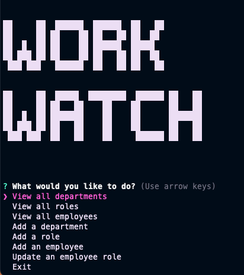

# Work Watch - Employee Tracker



This is a command-line application that allows users to manage a company's employee database, with functionalities such as viewing, adding, and updating employees, roles, and departments.

## Technologies Used

This application was built using the following technologies:

- Node.js
- Inquirer
- Console.table
- MySQL

## Installation

To install the necessary dependencies, run the following command:

`npm install`

You will also need to create a `.env` file with your MySQL credentials in the following format:

```
DB_NAME='employee_tracker'
DB_USER='<your MySQL username>'
DB_PASSWORD='<your MySQL password>'
```

## Usage

To start the application, run the following command:

`npm start`

You will be presented with a menu of options, including:

- View all departments
- View all roles
- View all employees
- Add a department
- Add a role
- Add an employee
- Update an employee role
- Exit

Select the option you want by using the arrow keys to navigate and press enter. Follow the prompts to complete the action.

## Contributing

Contributions are welcome. If you would like to contribute to this project, please create a pull request.

## Video Demonstration

Link to a video demo: [demo](https://drive.google.com/file/d/1iUj3JOSYMVcAMOOpDazKCE43r9AU6_8C/view?usp=share_link)
